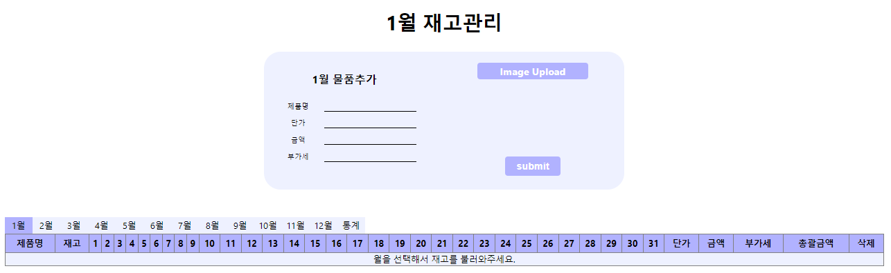
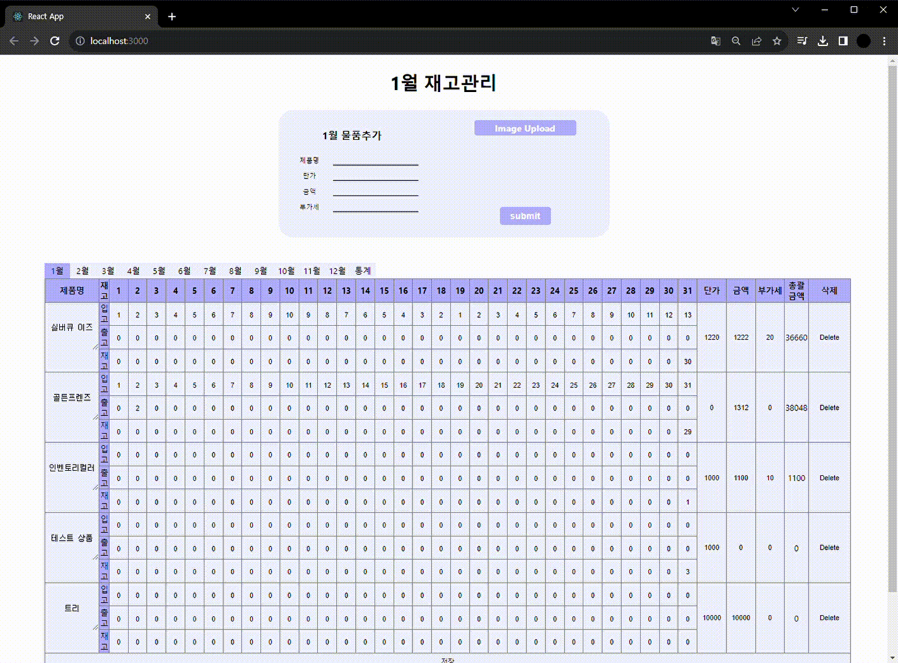
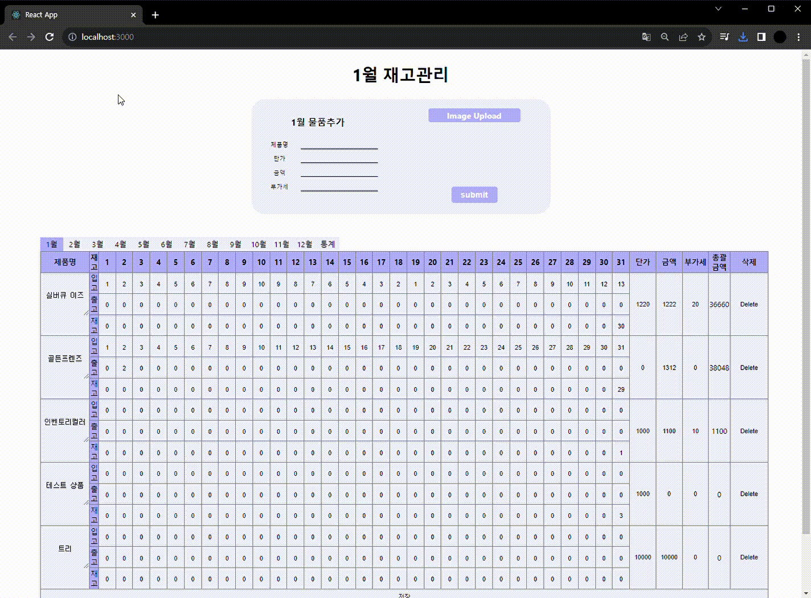
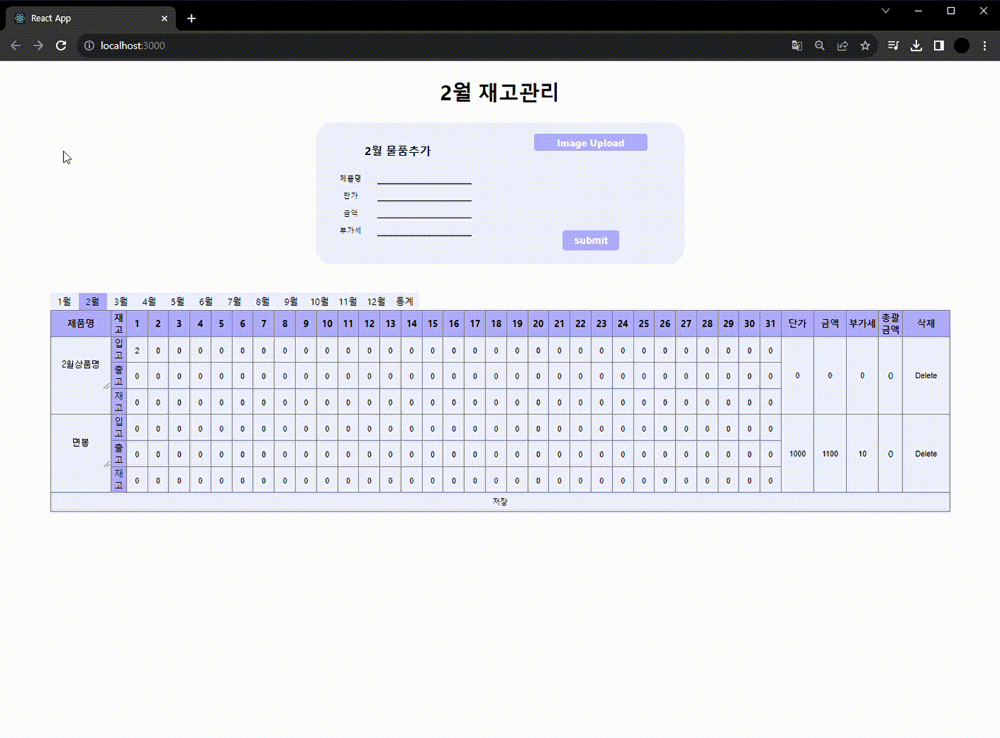
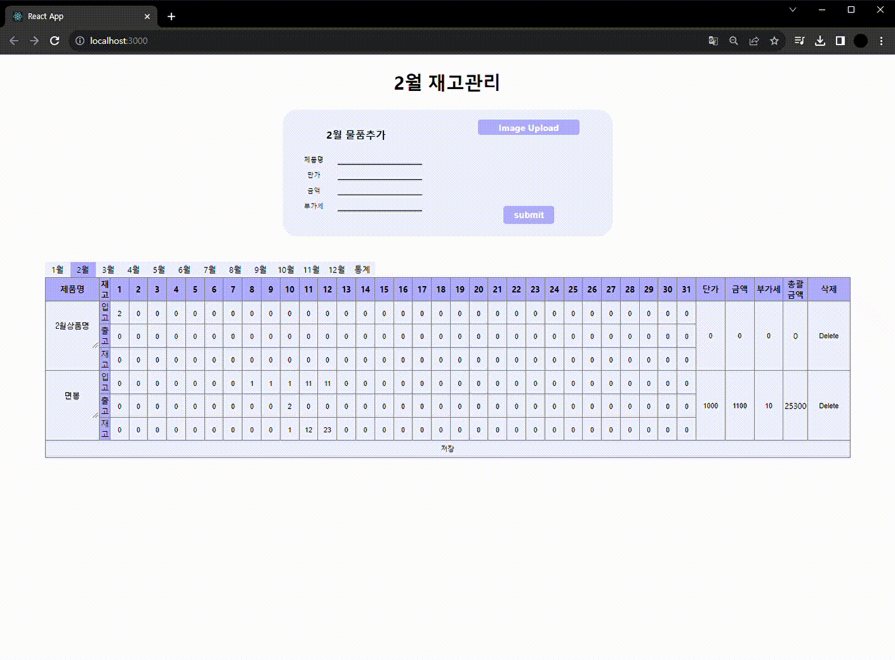
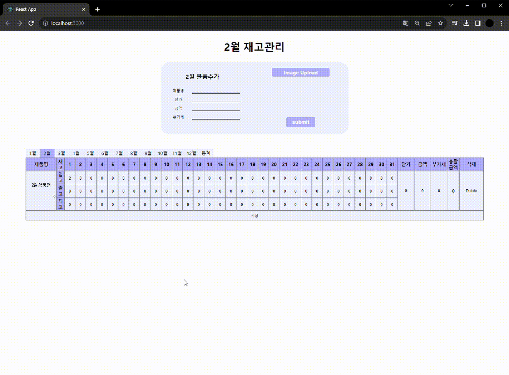

## 재고관리 사이트
### 프로젝트 개요
> 개발 스택 : React  
> 개발 기간 : 2023.1.23 ~ 2023.1.27  
> 개발 목표 : 간단하게 재고관리를 할 수 있는 사이트 제작  
> 주요 기능 : 각 달을 큰 목록으로 날마다 재고를 얼마나 사용 했는지 기록 및 확인   

### 메인화면
  

### 화면 별 기능
#### 월별 조회
 
각 월을 클릭하면 저장한 물품에 일별 사용량, 단가, 금액, 부가세, 총괄금액을 확인 할 수 있습니다.   

#### 물건 등록
 
상단에 폼을 통해 재고를 등록할 수 있습니다. 이때 사진도 업로드 할 수 있습니다.   

#### 물건 수정
 
각 물건은 단가, 금액, 부가세를 수정할 수 있으며, 일별 사용량 또한 변경 됩니다. 그리고 이에 따라 총괄 금액도 변경됩니다. 수정이 끝나면 하단 저장버튼을 누르면 적용됩니다.   

#### 물건 삭제
 
각 우측 버튼 delete버튼을 통해 삭제할 수 있습니다.   

#### 통계 확인
 
월 별 제품에 일별 금액 그래프를 볼 수 있습니다.   
